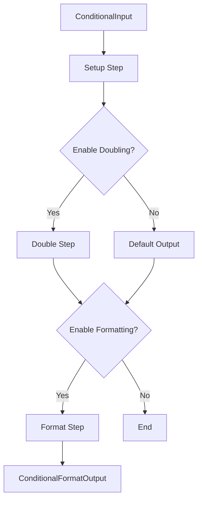

# Conditional Workflow Example

This example demonstrates how to use conditional logic within a workflow using the `ThenStepIf` builder method.

## Overview

The workflow processes an input value and optionally performs operations based on flags provided in the input.

It showcases:
- **Conditional Execution**: Using `ThenStepIf` to execute steps only when a condition is met.
- **State Management**: Storing flags in the workflow context state for use in conditions.
- **Default Values**: Providing default output values when a step is skipped.

## Workflow Structure

1.  **Setup Step** (`setup`):
    -   **Input**: `ConditionalInput` (Value, EnableDoubling, EnableFormatting)
    -   **Action**: Extracts `EnableDoubling` and `EnableFormatting` flags and stores them in the workflow state (`ctx.State`). Passes `Value` to the next step.
    -   **Output**: `DoubleInput` (Value)

2.  **Double Step** (`double`) - *Conditional*:
    -   **Condition**: Checks if `enable_doubling` is true in state.
    -   **Action**: Multiples the value by 2.
    -   **Default**: If skipped, returns a default object with `Value: 0` and `Doubled: false`.
    -   **Output**: `DoubleOutput` (Value, Doubled, Message)

3.  **Format Step** (`conditional_format`) - *Conditional*:
    -   **Condition**: Checks if `enable_formatting` is true in state.
    -   **Action**: Formats the result into a string.
    -   **Output**: `ConditionalFormatOutput` (Value, Formatted, Doubled)

## Data Flow



## Running the Example

1.  **Start the Server**:
    ```bash
    go run main/main.go
    ```

2.  **Trigger the Workflow (With Doubling)**:
    ```bash
    curl -X POST http://localhost:3000/api/v1/workflows/conditional \
      -H "Content-Type: application/json" \
      -d '{"value": 10, "enable_doubling": true, "enable_formatting": true}'
    ```

3.  **Trigger the Workflow (Without Doubling)**:
    ```bash
    curl -X POST http://localhost:3000/api/v1/workflows/conditional \
      -H "Content-Type: application/json" \
      -d '{"value": 10, "enable_doubling": false, "enable_formatting": true}'
    ```

## Key Code Concepts

### Conditional Builder
The `ThenStepIf` method takes the step, a condition function, and a default value.

```go
// Define condition
shouldDouble := func(ctx *gorkflow.StepContext) (bool, error) {
    var enable bool
    ctx.State.Get("enable_doubling", &enable)
    return enable, nil
}

// Add to workflow
builder.ThenStepIf(NewDoubleStep(), shouldDouble, doubleDefault)
```

### Using State
The `SetupStep` puts data into the context state, which is accessible by condition functions (and other steps).

```go
ctx.State.Set("enable_doubling", input.EnableDoubling)
```
