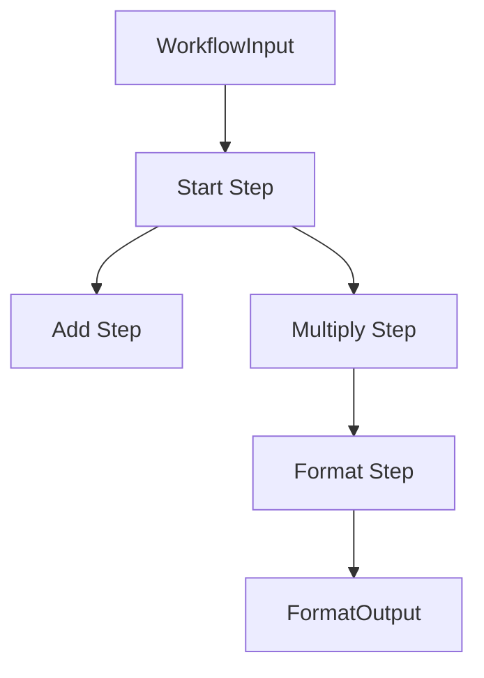

# Parallel Workflow Example

This example demonstrates how to define parallel execution branches in a workflow using the `Parallel` builder method.

## Overview

The workflow splits execution into two parallel branches that process the same input independently.

It showcases:
- **Parallel Definition**: Using `.Parallel()` to define steps that branch off from the previous step.
- **Independent Processing**: Steps receiving the same input and processing it differently.

## Workflow Structure

1.  **Start Step** (`start`):
    -   **Input**: `WorkflowInput`
    -   **Action**: Logs start of workflow.
    -   **Output**: `WorkflowInput` (Pass-through)

2.  **Parallel Branch**:
    The workflow splits into two steps executing conceptually in parallel:

    *   **Add Step** (`add`):
        -   **Input**: `WorkflowInput`
        -   **Action**: Adds `Val1` + `Val2`.
        -   **Output**: `AddOutput`

    *   **Multiply Step** (`multiply`):
        -   **Input**: `WorkflowInput`
        -   **Action**: Multiplies `Val1` * `Mult`.
        -   **Output**: `MultiplyOutput`

3.  **Format Step** (`format`):
    -   **Input**: `MultiplyOutput` (Receives output from the last executed parallel step)
    -   **Action**: Formats the result.
    -   **Output**: `FormatOutput`

## Data Flow



*Note: In the current engine implementation, parallel steps are executed in a deterministic topological order. The step following a parallel block receives the output of the last executed step in that block (in this case, `Multiply`).*

## Running the Example

1.  **Start the Server**:
    ```bash
    go run main/main.go
    ```

2.  **Trigger the Workflow**:
    ```bash
    curl -X POST http://localhost:3000/api/v1/workflows/simple-math \
      -H "Content-Type: application/json" \
      -d '{"val1": 10, "val2": 5, "mult": 2}'
    ```

## Key Code Concepts

### Parallel Builder
The `Parallel` method adds multiple steps that all branch from the previous step(s).

```go
builder.
    Sequence(NewStartStep()).
    Parallel(
        NewAddStep(),
        NewMultiplyStep(),
    )
```
