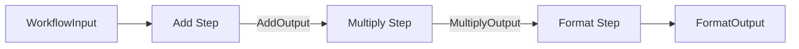

# Sequential Workflow Example

This example demonstrates the most basic usage of `gorkflow`: a linear sequence of steps where the output of one step becomes the input of the next.

## Overview

The workflow performs a simple mathematical operation: `(Val1 + Val2) * Mult`, and then formats the result into a string.

It showcases:
- **Type-safe data passing**: How data flows between steps using Go generics.
- **Step Configuration**: Setting retries, timeouts, and backoff strategies per step.
- **Sequential Execution**: Using `.Sequence()` to chain steps.

## Workflow Structure

The workflow consists of three steps executed in order:

1.  **Add Step** (`add`):
    -   **Input**: `WorkflowInput` (Val1, Val2, Mult)
    -   **Action**: Adds `Val1` and `Val2`.
    -   **Output**: `AddOutput` (Sum, Mult) - Passes `Mult` through for the next step.

2.  **Multiply Step** (`multiply`):
    -   **Input**: `AddOutput` (Value, Mult)
    -   **Action**: Multiplies the sum from the previous step by `Mult`.
    -   **Output**: `MultiplyOutput` (Value)
    -   **Configuration**: This step overrides default settings with 5 retries and exponential backoff.

3.  **Format Step** (`format`):
    -   **Input**: `MultiplyOutput` (Value)
    -   **Action**: Formats the final number into a message string.
    -   **Output**: `FormatOutput` (Message)

## Data Flow



## Running the Example

1.  **Start the Server**:
    ```bash
    go run main/main.go
    ```
    The server will start on `http://localhost:3000`.

2.  **Trigger the Workflow**:
    Send a POST request to start the workflow:
    ```bash
    curl -X POST http://localhost:3000/api/v1/workflows/simple-math \
      -H "Content-Type: application/json" \
      -d '{"val1": 10, "val2": 5, "mult": 2}'
    ```

3.  **Check Status**:
    Use the `runId` returned from the previous request:
    ```bash
    curl http://localhost:3000/api/v1/workflows/<runId>
    ```

## Key Code Concepts

### Defining Steps
Steps are defined using `gorkflow.NewStep`. Notice how the input and output types are strongly typed:

```go
func NewAddStep() *gorkflow.Step[WorkflowInput, AddOutput] {
    return gorkflow.NewStep(
        "add",
        "Add Numbers",
        func(ctx *gorkflow.StepContext, input WorkflowInput) (AddOutput, error) {
            // ... implementation
        },
    )
}
```

### Building the Workflow
The workflow is assembled using the builder pattern:

```go
builder.NewWorkflow("sequential", "Simple Math Workflow").
    Sequence(
        NewAddStep(),
        NewMultiplyStep(),
        NewFormatStep(),
    ).
    Build()
```
